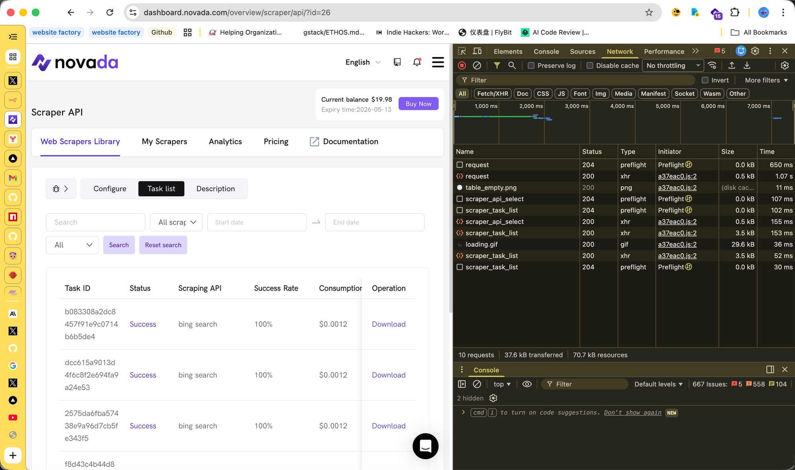
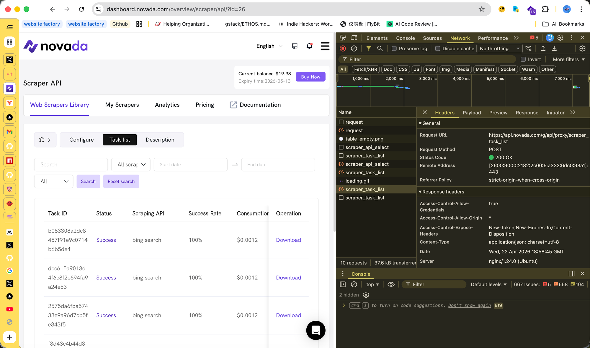
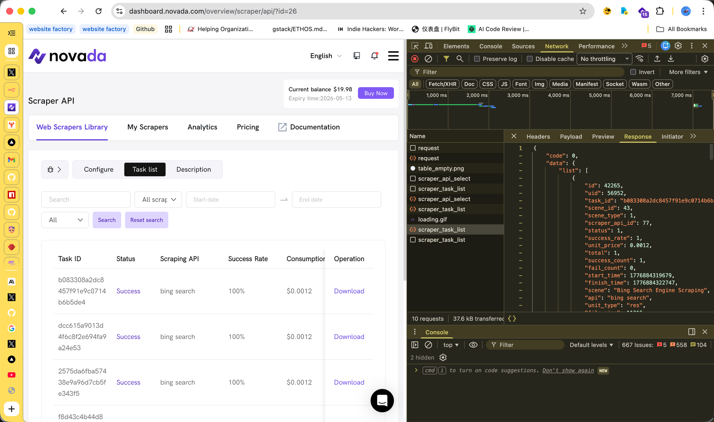
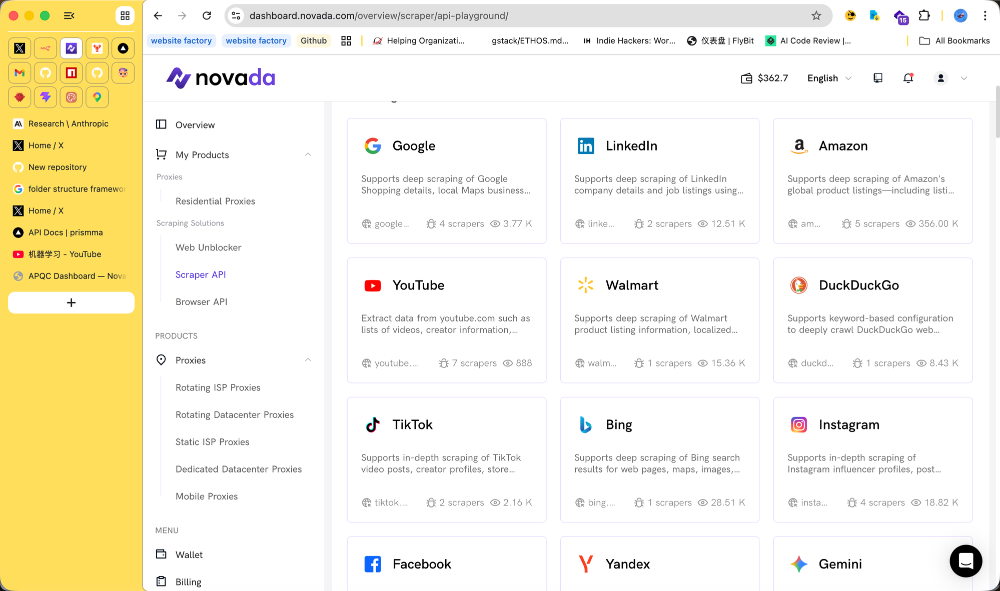

# Novada MCP 集成 — 根因已定位 + 技术对接问题
**来自：** Novada MCP 团队 | **日期：** 2026-04-22
**背景：** 构建 Novada 官方 MCP 服务器（供 AI Agent 使用），已发布到 npm（`novada-mcp`）

---

## 根因：任务提交和结果获取使用了不同的认证系统

我们找到了 Scraper API 在控制台可以用、但通过 CLI/MCP 无法获取结果的确切原因。

### 一张图说明问题

```
任务提交（正常）                        结果获取（被拦截）
──────────                             ──────────
POST scraper.novada.com/request        POST api.novada.com/g/api/proxy/scraper_task_list
认证: Bearer token ✅                   认证: Bearer token ❌ (code 10001: auth check error)
                                       认证: 控制台 Session Cookie ✅ (浏览器中正常)
返回: task_id                           返回: 任务列表 + 状态 + 下载链接
```

**Scraper API 用 Bearer token 接受任务提交，但结果获取端点只接受控制台的 Session Cookie。** 外部集成（MCP、CLI、SDK）无法获取结果。

### 验证过程

**第 1 步：** 通过 Bearer token 提交 Bing 搜索任务 — 成功：
```bash
$ curl -X POST "https://scraper.novada.com/request" \
  -H "Authorization: Bearer 1f35b4..." \
  -d "scraper_name=bing.com&scraper_id=bing_search&q=apple&json=1"

返回: {"code":0,"data":{"data":{"task_id":"b083308a2dc8..."}}}  ✅
```

**第 2 步：** 用同一个 Bearer token 获取结果 — 被拒绝：
```bash
$ curl -X POST "https://api.novada.com/g/api/proxy/scraper_task_list" \
  -H "Authorization: Bearer 1f35b4..."

返回: {"code":10001,"msg":"auth check error"}  ❌
```

**第 3 步：** 同一个端点在浏览器中（用 Session Cookie）正常工作：


*控制台 Task List — 所有任务显示 "Success"，100% 成功率，可以下载*

**第 4 步：** 通过 Chrome DevTools Network 面板确认了端点 URL：


*Headers 标签页: `POST https://api.novada.com/g/api/proxy/scraper_task_list` — 状态 200*

**第 5 步：** 响应包含完整的任务数据：


*Response 显示 task_id、status、success_rate、scene、api、时间戳等*

**第 6 步：** 下载的结果是完美的搜索数据 — 真实的 Bing 搜索结果：
```json
{
  "search_metadata": { "status": "Success", "total_time_taken": 2.06 },
  "search_information": { "total_results": 195000 },
  "organic_results": [
    { "rank": 1, "title": "Apple", "link": "https://www.apple.com" },
    { "rank": 2, "title": "Apple Inc. - Wikipedia", "link": "..." },
    { "rank": 3, "title": "Apple says John Ternus will be new CEO...", "link": "..." }
    // 共 10 条结果，全部相关
  ]
}
```

### 验证汇总表

| 测试 | 认证方式 | 端点 | 结果 |
|------|---------|------|------|
| 提交任务 | Bearer token | `scraper.novada.com/request` | ✅ 返回 task_id |
| 获取任务列表 | Bearer (Scraper key) | `api.novada.com/g/api/proxy/scraper_task_list` | ❌ `auth check error` |
| 获取任务列表 | Bearer (API key) | 同上 | ❌ `auth check error` |
| 获取任务列表 | 无认证 | 同上 | ❌ `auth fail` |
| 获取任务列表 | 控制台 Session Cookie | 同上 | ✅ 返回完整任务列表 |
| 下载结果 | 控制台 Session Cookie | 下载链接 | ✅ 完美的搜索 JSON |

---

## 我们需要什么（一个改动）

**让结果获取端点接受 Bearer token 认证** — 和任务提交使用相同的 token。

两种方案均可：
1. 给 `api.novada.com/g/api/proxy/scraper_task_list` 添加 Bearer token 认证支持
2. 或创建新的公开端点：`scraper.novada.com/task/{task_id}`，支持 Bearer token

**这一个改动就能为所有外部集成解锁整个 Scraper API。** 没有它，只有控制台能用爬虫。

---

## 已确认正常工作的部分

爬虫本身非常好。Bing 搜索在 2 秒内返回 10 条完美相关的结果，费用 $0.0012。我们验证了：

| 引擎 | scraper_id | 任务提交 | 结果质量 |
|------|-----------|---------|---------|
| Google | `google_search` | ✅ | 无法通过 API 获取（认证问题） |
| Bing | `bing_search` | ✅ | ✅ 完美（通过控制台下载验证） |
| DuckDuckGo | `duckduckgo` | ✅ | 无法通过 API 获取（认证问题） |
| Yandex | `yandex` | ✅ | 无法通过 API 获取（认证问题） |
| Yahoo | `yahoo_search` | ❌ 11006 | 不可用 |

爬虫库非常丰富：


*Google、Bing、DDG、Amazon、YouTube、LinkedIn、TikTok、GitHub、eBay 等*

---

## 其他问题

| # | 问题 | 优先级 |
|---|------|-------|
| 1 | **结果获取端点支持 Bearer token 认证** | 关键 — 阻塞所有外部集成 |
| 2 | 所有搜索引擎的正确 scraper_id | 高 |
| 3 | Yahoo 的 scraper_id（或确认不可用） | 中 |
| 4 | 爬虫库中哪些是生产就绪的？ | 高 |
| 5 | `scraperapi.novada.com` 是否已被 `scraper.novada.com` 替代？ | 中 |

---

## 为什么这很重要

我们构建了 Novada MCP 服务器，提供 5 个工具供 AI Agent 使用，已发布到 npm、Smithery、LobeHub。一旦 Bearer token 认证统一，我们就能将搜索从旧端点迁移到 Scraper API — 为所有使用 Novada 的 AI Agent 解锁 4 个搜索引擎（Google、Bing、DDG、Yandex）。

**产品基础设施很强。这是最后一块拼图。**

---

*Novada MCP v0.6.5 — 117 个测试通过，已发布到 npm。*
